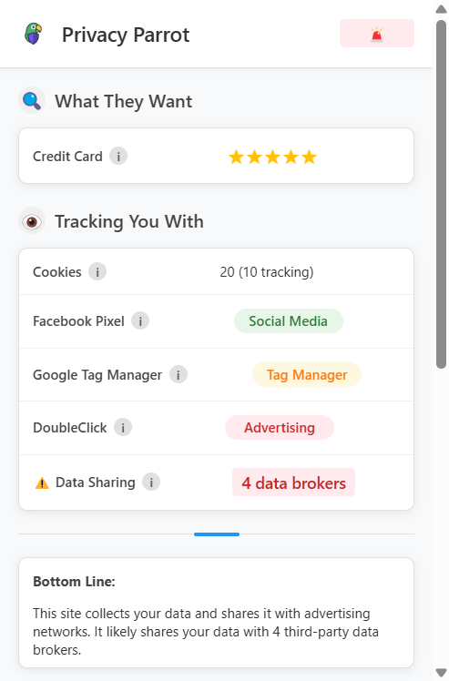
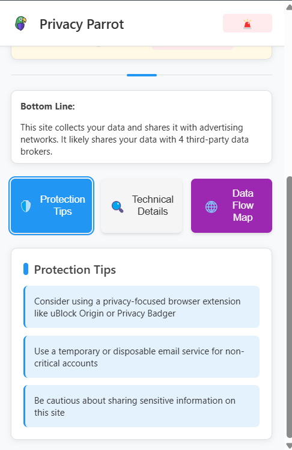
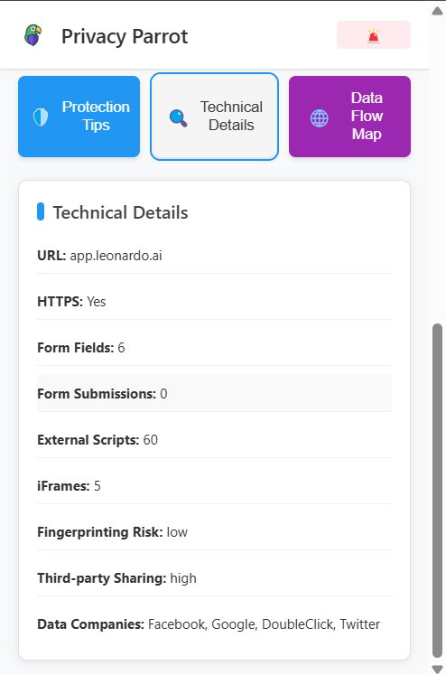
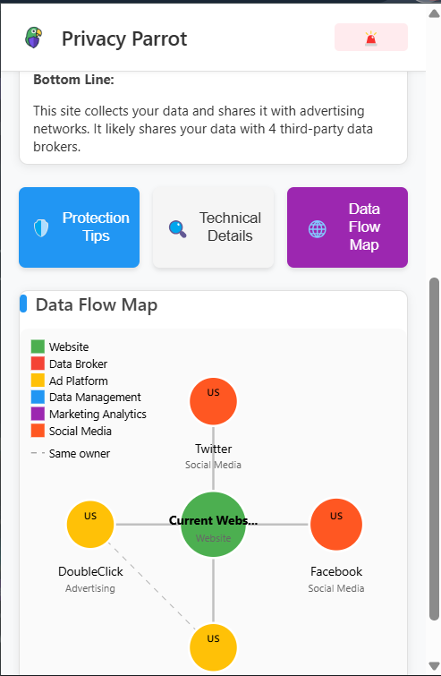

# Privacy Parrot Chrome Extension


A privacy assistant that automatically analyzes webpages and explains their data practices in simple, human-readable language. Privacy Parrot helps users understand how websites collect, track, and share their data with interactive visualizations and plain language explanations.

## Features

- **Instant Privacy Snapshot**: One-click analysis of website privacy practices.
- **Visual Risk Indicators**: Color-coded risk levels with simple icons showing low, medium, or high risk.
- **Plain Language Explanations**: Human-readable privacy summaries that explain technical concepts.
- **Protection Tips**: Actionable advice based on detected privacy risks.
- **Data Flow Map**: Interactive visualization showing how your data flows to third parties, including:
  - Corporate ownership connections
  - Geographic data residency indicators
  - Company type categorization

## Screenshots

### Main Privacy Analysis


### Data Collection Details


### Technical Details View


### Data Flow Map Visualization


## Installation

### Option 1: Install from Chrome Web Store
*Coming soon*

### Option 2: Manual Installation
1. Download or clone this repository
2. Open Chrome and navigate to `chrome://extensions/`
3. Enable "Developer mode" in the top-right corner
4. Click "Load unpacked" and select the directory containing this extension
5. The Privacy Parrot icon should appear in your browser toolbar

## Usage

1. Visit any website you want to analyze
2. Click the Privacy Parrot icon in your browser toolbar
3. Review the instant privacy snapshot with:
   - Data collection points
   - Tracking summary
   - Bottom-line explanation
4. Click "Show Protection Tips" to see personalized privacy recommendations
5. Click "Technical Details" to view more in-depth information
6. Click "Data Flow Map" to visualize how your data is shared with third parties

### Data Flow Map

The Data Flow Map provides an interactive visualization of:
- How your data flows from the current website to third-party companies
- What types of companies receive your data (ad platforms, data brokers, etc.)
- Where your data is stored geographically (indicated by country flags)
- Corporate relationships between different companies

Features:
- Drag nodes to rearrange the visualization
- Hover over nodes for detailed information
- Color-coded companies by type
- Dotted lines show corporate ownership connections

## Technical Architecture

### Project Structure
- `manifest.json`: Extension configuration
- `popup.html` & `css/popup.css`: UI for the popup
- `js/popup.js`: Controls the popup interface and visualizations
- `content.js`: Analyzes page content and detects tracking technologies
- `background.js`: Handles background tasks and browser icon updates
- `icons/`: Extension icons
- `lib/`: Third-party libraries (D3.js for visualization)

### Core Components

1. **Content Script (`content.js`)**
   - Executes on each webpage
   - Analyzes DOM for tracking elements
   - Detects cookies, local storage usage
   - Identifies third-party resources and data sharing
   - Detects common tracking scripts and pixels

2. **Popup Interface (`popup.js`, `popup.html`, `popup.css`)**
   - Displays analysis results in user-friendly format
   - Handles UI interactions and animations
   - Renders the Data Flow Map visualization using D3.js
   - Generates protection tips based on detected risks

3. **Background Service (`background.js`)**
   - Manages extension icon based on risk level
   - Handles message passing between components
   - Maintains state across browsing sessions

### Analysis Capabilities

Privacy Parrot can detect:
- Cookie usage and persistence
- Local storage data
- Third-party requests and resources
- Common tracking technologies (Google Analytics, Facebook Pixel, etc.)
- Form input fields that may collect sensitive information
- Session recording and user behavior tracking
- Geographic data residency information
- Corporate ownership relationships between data companies

## Development

### Prerequisites
- Basic knowledge of HTML, CSS, and JavaScript
- Chrome browser

### Adding Custom Analysis Algorithms

The extension is designed to be modular, allowing you to add new analysis capabilities. Here's how to add your own algorithm:

1. **Identify the analysis category**:
   - Data collection detection
   - Tracking scripts detection
   - Privacy policy analysis
   - User fingerprinting
   - Third-party data sharing
   - Custom category

2. **Create a new detection function** in `content.js`:
   ```javascript
   function detectYourNewFeature() {
     // Implement your analysis logic
     // ...
     
     return {
       // Return structured data about your findings
       detected: true,
       riskLevel: 'medium', // Use consistent risk levels: low, medium, high
       details: {...}
     };
   }
   ```

3. **Update the main analysis function** in `content.js`:
   ```javascript
   function analyzePagePrivacy() {
     // Add your new function call
     const yourFeatureInfo = detectYourNewFeature();
     
     // Add to risk calculation
     const riskLevel = calculateRiskLevel(..., yourFeatureInfo);
     
     // Add to results object
     return {
       // Existing data...
       yourFeature: yourFeatureInfo
     };
   }
   ```

4. **Test thoroughly** on various websites to ensure your algorithm works correctly

### Testing
1. Make your changes to the code
2. Go to `chrome://extensions/` and click the refresh icon on the extension
3. Test the extension on various websites

## Limitations and Known Issues

- Chrome's Content Security Policy restricts analysis on certain pages (chrome:// URLs, Web Store)
- Analysis accuracy depends on content being loaded at the time of analysis
- Advanced tracking techniques might not be detected
- Some data flow connections are inferred based on known relationships rather than direct observation

## Privacy Guarantee

This extension:
- Works entirely locally on your device
- Does not send any browsing data to remote servers
- Does not track, store, or share your browsing history
- Is completely open source for transparency

## Future Enhancements

- Enhanced data sharing detection
- Privacy policy automatic analysis
- Historical tracking comparison
- Custom alert thresholds
- Export privacy reports

## License

MIT License

## Contact

For questions, suggestions, or issues, please open an issue on the [GitHub repository](https://github.com/GangadharGaikwad/privacy-parrot).

